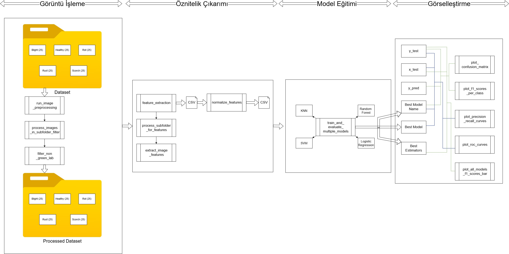

# Veri Bilimi Grup-2 Proje

## Makine Öğrenmesi ile Yaprak Hastalıklarının Tespiti ve Sınıflandırılması

Bu proje, makine öğrenmesi teknikleri kullanarak çeşitli bitki yapraklarındaki hastalıkları tespit etmeyi ve sınıflandırmayı amaçlamaktadır. Proje kapsamında, Kaggle platformundan alınan bir veri seti kullanılarak dört farklı yaprak hastalığı (yanıklık - blight, çürüklük - rot, pas - rust, leke - scorch) ve sağlıklı yapraklar sınıflandırılmıştır.


*Şekil: Projenin genel iş akış şeması.*

### Projenin Amacı

Bitki hastalıkları, tarımsal üretimde önemli kayıplara yol açabilmektedir. Bu hastalıkların erken teşhisi ve doğru sınıflandırılması, zamanında müdahale edilerek verim kayıplarının önlenmesi açısından kritik öneme sahiptir. Bu proje, görüntü işleme ve makine öğrenmesi yöntemlerini bir araya getirerek bu sürece otomatize bir çözüm sunmayı hedeflemektedir.

### Kullanılan Veri Seti

Projede kullanılan temel veri seti Kaggle platformunda yer alan "PlantVillage Dataset"in bir alt kümesidir.
* **Veri Seti Kaynağı:** [PlantVillage Dataset on Kaggle](https://www.kaggle.com/datasets/emmarex/plantdisease)

Bu genel veri setinden proje kapsamında aşağıdaki adımlar izlenerek özel bir çalışma seti oluşturulmuştur:
1.  Dört farklı hastalık türü belirlenmiştir:
    * Yanıklık (Blight)
    * Çürüklük (Rot)
    * Pas (Rust)
    * Leke (Scorch)
2.  Belirlenen her bir hastalık türü için Kaggle veri setinden rastgele 25 adet yaprak görseli seçilmiştir.
3.  Ayrıca, sağlıklı yapraklara ait görseller de veri setine dahil edilmiştir 
4.  Oluşturulan bu alt veri seti, projenin eğitim ve test aşamalarında kullanılmıştır.

## Kurulum

Projeyi yerel makinenizde çalıştırmak için aşağıdaki adımları izleyebilirsiniz:

1.  **Python Kurulumu:**
    Proje **Python 3.12** sürümü ile geliştirilmiştir. Eğer sisteminizde Python 3.12 kurulu değilse, [python.org](https://www.python.org/downloads/) adresinden indirip kurabilirsiniz.


2.  **Proje Dosyalarının İndirilmesi:**
    Bu Git deposunu klonlayın veya ZIP olarak indirin:


3.  **Sanal Ortam Oluşturma ve Aktifleştirme (Önerilir):**
    Proje bağımlılıklarını sistem genelindeki Python kurulumunuzdan izole etmek için bir sanal ortam oluşturmanız tavsiye edilir.
    ```bash
    python -m venv venv
    ```
    Sanal ortamı aktifleştirin:
    * Windows:
        ```bash
        .\venv\Scripts\activate
        ```
    * macOS/Linux:
        ```bash
        source venv/bin/activate
        ```

4.  **Gerekli Kütüphanelerin Yüklenmesi:**
    Projenin çalışması için gerekli olan tüm Python kütüphaneleri `requirements.txt` dosyasında listelenmiştir. Bu kütüphaneleri aşağıdaki komut ile yükleyebilirsiniz:
    ```bash
    pip install -r requirements.txt
    ```


## Proje İş Akışı

Proje genel olarak aşağıdaki adımları takip etmektedir:

1.  **Veri Toplama ve Hazırlık:**
    * Yukarıda belirtilen Kaggle veri setinden ilgili hastalık ve sağlıklı yaprak görselleri seçilmiştir.
    * Görseller, her bir sınıf (hastalık türü veya sağlıklı) için ayrı klasörlerde düzenlenmiştir (`dataset` klasörü).


2.  **Görüntü Ön İşleme (`run_image_preprocessing`):**
    * Yaprak görsellerindeki arka plan gürültüsünü azaltmak ve hastalık belirtilerini daha belirgin hale getirmek amacıyla ön işleme adımları uygulanmıştır.
    * Bu adımda özellikle yeşil olmayan (hastalıklı olabilecek) bölgelerin LAB renk uzayında filtrelenmesi (`filter_non_green_lab`) gibi teknikler kullanılmıştır.
    * İşlenmiş görüntüler `output_preprocessed_images` klasörüne kaydedilmiştir.


3.  **Öznitelik Çıkarımı (`feature_extraction`):**
    * Ön işlenmiş görüntülerden makine öğrenmesi modelinin kullanabileceği sayısal öznitelikler çıkarılmıştır.
    * Çıkarılan öznitelikler arasında enerji, homojenlik, RMSE, düzgünlük, çarpıklık, basıklık, kontrast, standart sapma, ortalama, Shannon entropisi, korelasyon, ters fark momenti ve varyans gibi istatistiksel ve dokusal özellikler bulunmaktadır.
    * Bu öznitelikler, her bir görüntü için hesaplanmış ve etiketleriyle birlikte `image_features_raw.csv` dosyasına kaydedilmiştir.


4.  **Öznitelik Normalleştirme (`normalize_features`):**
    * Çıkarılan özniteliklerin farklı ölçeklerde olması model performansını olumsuz etkileyebileceğinden, tüm öznitelikler genellikle 0-1 arasına ölçeklendirilmiştir (MinMaxScaler).
    * Normalleştirilmiş öznitelikler `normalized_features.csv` dosyasına kaydedilmiştir.


5.  **Model Eğitimi ve Değerlendirmesi (`train_and_evaluate_svm`):**
    * Normalleştirilmiş öznitelikler kullanılarak bir Destek Vektör Makinesi (SVM) modeli eğitilmiştir.
    * Modelin en iyi hiperparametrelerini (C değeri, kernel türü vb.) bulmak için katmanlı çapraz doğrulama (Stratified K-Fold Cross-Validation) tekniği kullanılmıştır.
    * En iyi parametrelerle eğitilen model, daha önce hiç görmediği bir test seti üzerinde değerlendirilmiştir.
    * Model performansı; doğruluk (accuracy), sınıflandırma raporu (precision, recall, F1-score), karmaşıklık matrisi (confusion matrix) ve ROC-AUC skorları gibi metriklerle ölçülmüştür.


6.  **Sonuçların Görselleştirilmesi:**
    * Çapraz doğrulama sonuçları, karmaşıklık matrisi, ROC eğrileri, Precision-Recall eğrileri ve her sınıf için F1 skorları gibi performans metrikleri grafiksel olarak görselleştirilmiştir. Bu, modelin güçlü ve zayıf yönlerinin daha iyi anlaşılmasına yardımcı olur.

